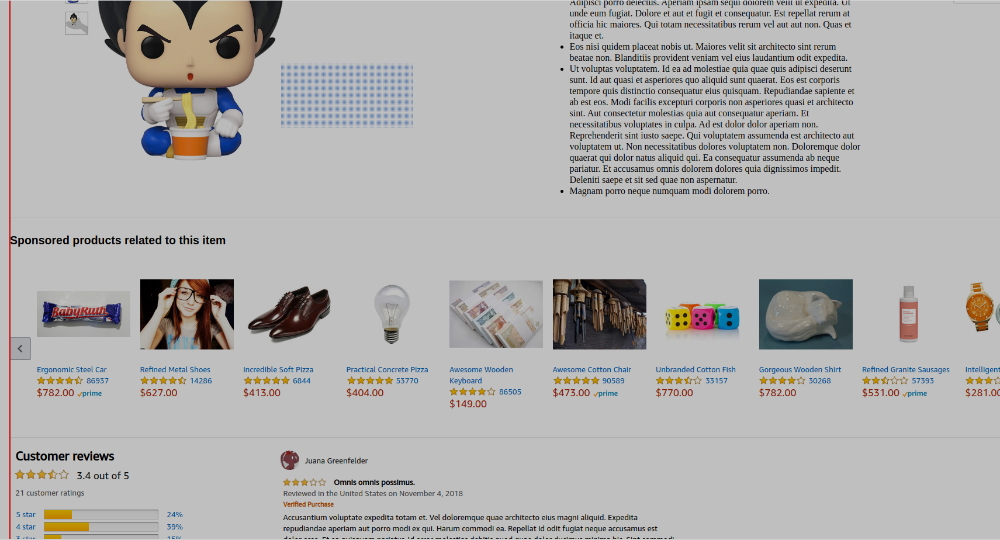
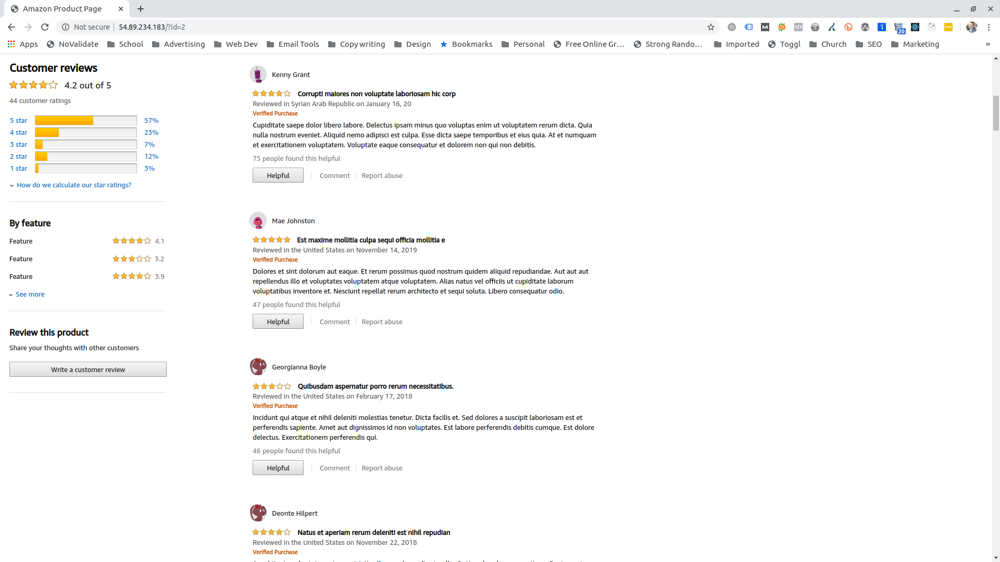

# Good Ecom
Proxy for the 4 microservices linked to Good Ecom, a replication of the popular e-commerce site Amazon.

### Product Image, Product Description, and Image Carousel


### Reviews
* User interactable reviews component from consumers who have purchased the product.


## Getting started
```sh
npm install
npm start
```

## Technology stack

> A full stack react app built with the philosophy of continuously-integrated, test-driven development.

- CSS
- HTML5
- Node
- Express
- Mariadb

## Development

From within the root directory:

To run server

```sh
npm run start:dev
```
